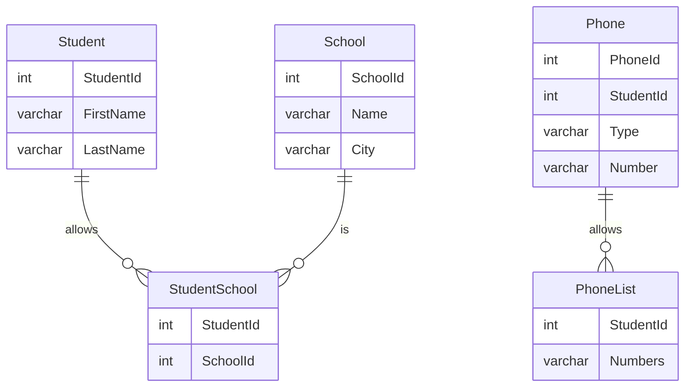

# db-poject-2022

```mermaid
erDiagram


Student ||--o{ StudentSchool : allows
Student {
  int StudentId
  varchar FirstName
  varchar LastName
}
School ||--o{ StudentSchool : is
School {
  int SchoolId
  varchar Name
  varchar City
}


StudentSchool { 
int StudentId
int SchoolId
}

Phone || --o{ PhoneList : allows
Phone {
int PhoneId
int StudentId
varchar Type
varchar Number
}
PhoneList {
int StudentId
varchar Numbers
}

```
